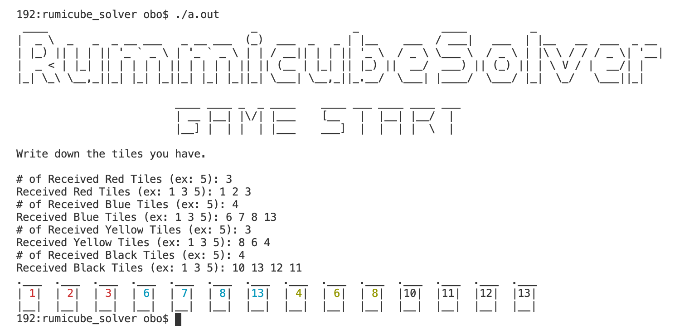

```
 ____                                _               _             ____          _                    
|  _ \  _   _  _ __ ___   _ __ ___  (_)  ___  _   _ | |__    ___  / ___|   ___  | |__   __  ___  _ __ 
| |_) || | | || '_ ` _ \ | '_ ` _ \ | | / __|| | | || '_ \  / _ \ \___ \  / _ \ | |\ \ / / / _ \| '__|
|  _ < | |_| || | | | | || | | | | || || (__ | |_| || |_) ||  __/  ___) || (_) || | \ V / |  __/| |   
|_| \_\ \__,_||_| |_| |_||_| |_| |_||_| \___| \__,_||_.__/  \___| |____/  \___/ |_|  \_/   \___||_|   
                                                                                                      
```

## Rummicube Solver

I like the RummiCube board game. I have a strong desire to win. I wondered if it was a losing game because the cards I received in the RummiCube game were not good or if I lost because I was not good enough.
 

## How to play

It starts with 14 tiles, each for 2-4 people. Combine and put down the tiles you have on the table according to the rules, so that the person who puts down all the tiles he/she has and burns them out wins.

## Rule

### Resister

Before combining the cards at the table, you must set them up through the procedure called Registration. The initial registration is subject to the following conditions:
- You have to do it with the tiles you have.
- The tile value must be at least 30. (Tile values are the numbers engraved on the tiles.)
Laying tiles on the table shall be arranged according to the following conditions.
### Play

- a combination of three or more numbers in the same color.
- a combination of three or four numbers of the same value for different colors.

## To Do List

- [x] ~~enter the 14 tiles received by color.~~
- [x] ~~get iput usig ```map```~~
- [ ] Among the 14 tiles received, select the ones that can be registered.
- [ ] Comming soon..

### Current Executon Screen

