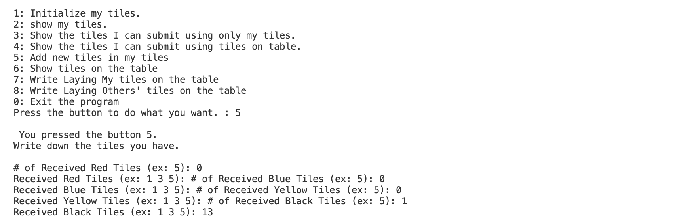
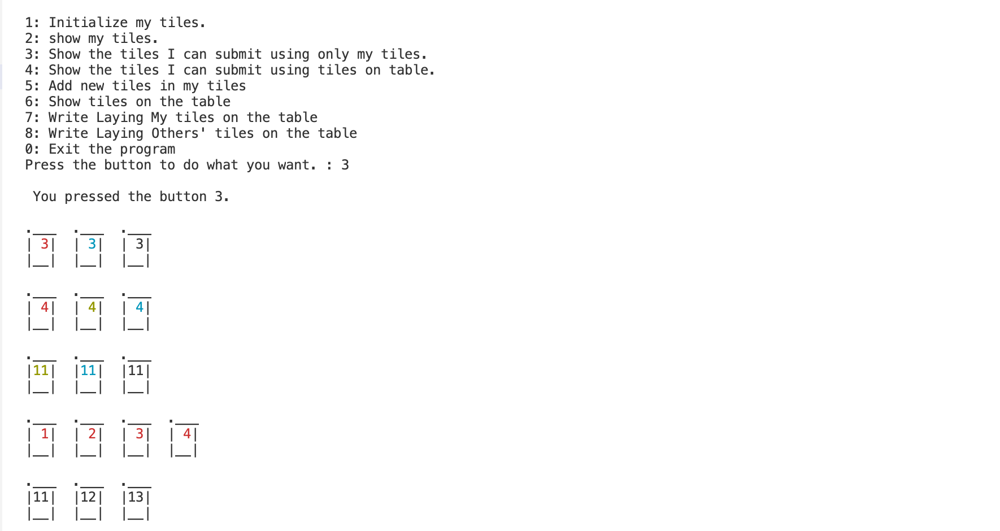
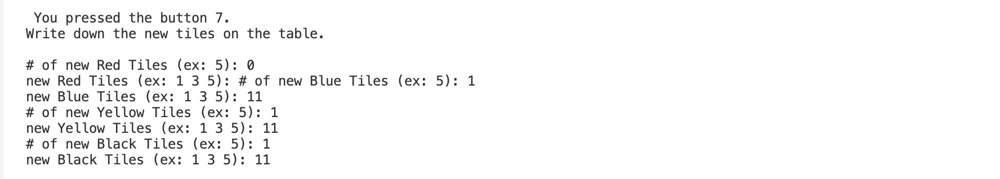
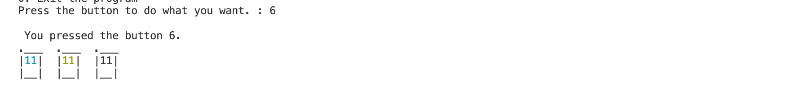
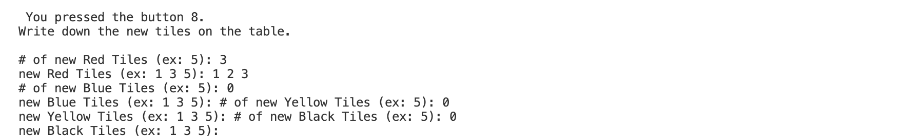
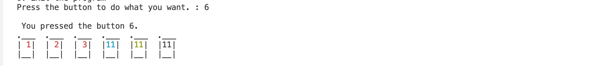

```
 ____                                _  _            _       ____          _                    
|  _ \  _   _  _ __ ___   _ __ ___  (_)| | __ _   _ | |__   / ___|   ___  | |__   __  ___  _ __ 
| |_) || | | || '_ ` _ \ | '_ ` _ \ | || |/ /| | | || '_ \  \___ \  / _ \ | |\ \ / / / _ \| '__|
|  _ < | |_| || | | | | || | | | | || ||   < | |_| || |_) |  ___) || (_) || | \ V / |  __/| |   
|_| \_\ \__,_||_| |_| |_||_| |_| |_||_||_|\_\ \__,_||_.__/  |____/  \___/ |_|  \_/   \___||_|   
```
***You can see README in **[KOR](https://github.com/happyOBO/rummicube_solver/blob/master/README_kor.md)*****
## Rummicube Solver

I like the RummiCube board game. I have a strong desire to win. After losing a series of Rummikub games, I thought. Was I unlucky enough to win with the tiles I got? or Is it because I'm not good enough? This program proposes a solution of all the tiles I can register. If you use this and lose, you're unlucky.

## How to play

It starts with 14 tiles, each for 2-4 people. Combine and put down the tiles you have on the table according to the rules, so that the person who puts down all the tiles he/she has and burns them out wins.

## Rule

### Resister

Before combining the cards at the table, you must set them up through the procedure called Registration. The initial registration is subject to the following conditions:
- You have to do it with the tiles you have.
- The tile value must be at least 30. (Tile values are the numbers engraved on the tiles.)
Laying tiles on the table shall be arranged according to the following conditions.
### Play

- a combination of three or more numbers in the same color.
- a combination of three or four numbers of the same value for different colors.

## To Do List

- [x] ~~enter the 14 tiles received by color.~~
- [x] ~~get iput usig ```map```~~
- [x] ~~Among the 14 tiles received, select the ones that can be registered.~~
- [x] Show tiles on the table
- [ ] Show the tiles I can submit using tiles on table.
- [x] ~~Add new tiles in my tiles~~
- [x] Write Laying My tiles on the table
- [x] Write Laying Other's tiles on the table
- [x] Determine which tiles can be submitted, including those on the table.

## Current Executon Screen

### Initialize my tiles. (press ``button 1``)
***


### show my tiles. (press ``button 2``)
***


### Show the tiles I can submit. (press ``button 3``)
***


### Show the tiles I can submit. (press ``button 3``)
***

### add new tiles and Show the tiles I can submit. (press ``button 5`` and ``button 6``)
***



### Write Laying My tiles on the table and Show the tiles on table. (press ``button 7`` and ``button 6``)
***



### Write Laying My tiles on the table and Show the tiles on table.(press ``button 8`` and ``button 6``)
***




### Exit the program (press ``button 0``)
***
