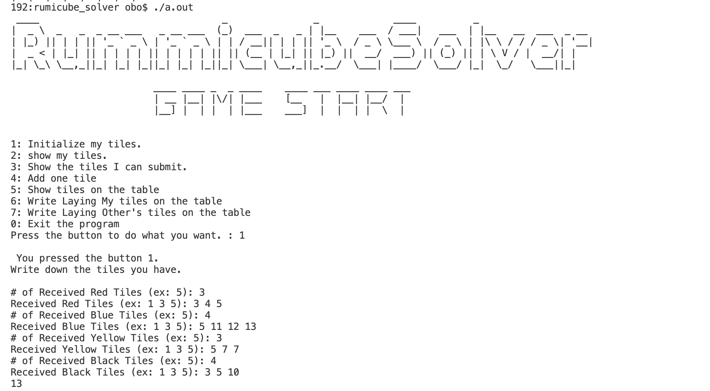
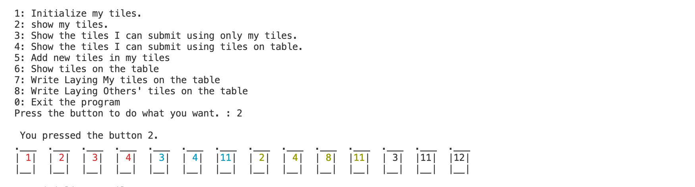
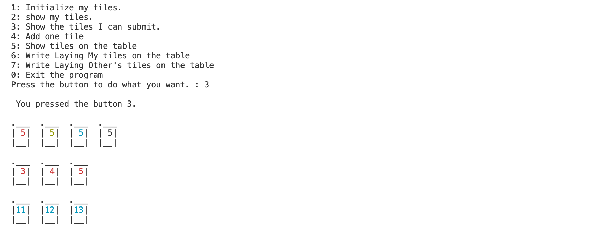
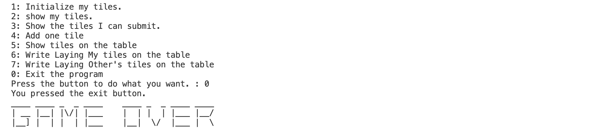

```
 ____                                _               _             ____          _                    
|  _ \  _   _  _ __ ___   _ __ ___  (_)  ___  _   _ | |__    ___  / ___|   ___  | |__   __  ___  _ __ 
| |_) || | | || '_ ` _ \ | '_ ` _ \ | | / __|| | | || '_ \  / _ \ \___ \  / _ \ | |\ \ / / / _ \| '__|
|  _ < | |_| || | | | | || | | | | || || (__ | |_| || |_) ||  __/  ___) || (_) || | \ V / |  __/| |   
|_| \_\ \__,_||_| |_| |_||_| |_| |_||_| \___| \__,_||_.__/  \___| |____/  \___/ |_|  \_/   \___||_|   
                                                                                                      
```

## Rummicube Solver

본 개발자는 루미큐브라는 보드게임을 좋아합니다! 물론 게임에서 이기기도 하고 지기도 합니다. 연속적으로 게임에서 패했을 때 내가 실력이 떨어져서 졌던 판인지, 아니면 내가 날고 기어도 타일(tile)운이 안 따라줬기 때문에 질 수 밖에 없던 판이었는지 궁금해졌습니다. 만약에 본 루비큐브 게임 도우미(R
ummicube Solver)를 이용해서 게임을 했는데도 졌다면, 그건 내 실력 탓이 아니라 타일 운이 좋지 않았다고 말할 수 있지 않을까요?

## How to play

타일은 1 - 13의 숫자가 red,blue,yello,black 색으로 쓰여진 두 세트와 조커 2개로 총 106개의 타일로 이루어져 있습니다. 처음에 무작위로 14개의 타일을 받습니다. 자신이 가진 타일들을 테이블에 놓아 제일 먼저 소진시킨 사람이 이기는 게임입니다. 타일을 테이블에 놓을 수 있는 법은 아래와 같습니다.

## Rule

1. 타일에 써진 숫자의 값이 같고, 서로 색이 다른 3개 이상의 타일 조합
2. 타일의 숫자 색이 같고, 연속적인 숫자 3개 이상의 타일 조합
3. 단, 테이블에 타일들을 처음 놓을 때는 자신의 타일들만을 이용해 놓는 타일들의 숫자 총합이 30 이상이어야 한다.
    - 예시
        - 빨 11,빨 12,빨 13 (2번 조건 만족 및 총합 36)
        - 빨 1, 노 1, 파 1 + 검 8, 검 9, 검 10 (2,3번 조건 만족 및 총합 30)
3. 테이블에 자신의 타일을 놓았다면, 다음 차례부터 테이블에 놓은 타일들과 자신의 타일을 이용해 1,2 룰을 만족시키는 타일들을 테이블에 놓는다.

## To Do List

- [x] ~~처음 14개의 타일들 입력 받기(1번 버튼)~~
- [x] ~~```map```을 사용해서 타일들 저장~~
- [x] ~~현재 내 타일 출력(2번 버튼)~~
- [x] ~~가지고 있는 내 타일들 만을 이용해 조합 가능한 타일들 제시(3번 버튼)~~
- [ ] ~~테이블과 내 타일들을 이용해 조합 가능한 타일들 제시(4번 버튼)~~
- [x] ~~나의 새 타일 추가(5번 버튼)~~
- [x] ~~프로그램 종료(0번 버튼)~~
- [x] 테이블에 놓여진 타일들 출력(6번 버튼)
- [x] 테이블에 내 타일 놓기(7번 버튼)
- [x] 다른사람이 테이블에 놓은 타일들 등록(8번 버튼)


## Current Executon Screen

### Initialize my tiles. (press ``button 1``)
***


### show my tiles. (press ``button 2``)
***


### Show the tiles I can submit. (press ``button 3``)
***

### Exit the program (press ``button 0``)
***
